# Cepheus ROS1 Noetic Release


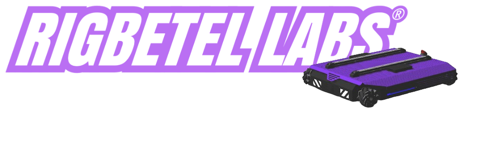

<div align="center">

Welcome to the official public repository for **Cepheus** by **RigBetel Labs**.

**Purpose:**  
This repository hosts essential documentation and code for *Cepheus Robot*, facilitating transparency and collaboration.

**Privacy:**  
Certain sensitive packages and scripts have been excluded to maintain privacy standards.

**Contents:**  
- **Documentation:** Detailed guides and technical specifications.
- **Codebase:** Essential source code for *Cepheus Robot*.
- **Resources:** Supplementary materials and dependencies.


**Contact:**  
For inquiries and collaboration opportunities, reach out to RigBetel Labs.


<a href="https://rigbetellabs.com/"></a>
<a href="https://www.youtube.com/channel/UCfIX89y8OvDIbEFZAAciHEA"></a>
<a href="https://www.instagram.com/rigbetellabs/"></a>


</div>

--- 

## Table of Contents
- [**1. Installation**](#1-installation)
- [**2. Connection**](#2-connection)
- [**3. NUC Instructions**](#3-nuc-instructions)
- [**4. Package Description**](#4-package-description)
   - [**4.1 cepheus_description**](#41-cepheus_description)
   - [**4.2 cepheus_firmware**](#42-cepheus_firmware)
   - [**4.3 cepheus_gazebo**](#43-cepheus_gazebo)
   - [**4.4 cepheus_navigation**](#44-cepheus_navigation)
   - [**4.5 cepheus_odometry**](#45-cepheus_odometry)
   - [**4.6 cepheus_slam**](#46-cepheus_slam)
- [**5. Launch Sequence**](#5-launch-sequence)
   - [**5.1 Map Generation**](#51-map-generation)
   - [**5.2 Autonomous Navigation**](#52-autonomous-navigation-in-the-saved-map)
- [**6. Important Low level Topics**](#6-low-level-ros-topics)
- [**7. Cepheus Robot Parameters**](#7-cepheus-robot-parameters)
- [**8. Diagnostic Tests**](#8-diagnostic-tests)
- [**9. Joystick Control Instructions**](#9-joystick-control-instructions)
- [**10. LED indicators Instructions**](#10-led-indicators-instructions)

## 1. Installation

```bash
cd ~/ros1_ws/src  # Assuming ros1_ws is the name of the workspace
```

Clone the repository into your workspace:

```bash
git clone https://github.com/rigbetellabs/cepheus.git
```

Install dependent packages:

```bash
cd ~/ros1_ws/src/cepheus
cat requirements.txt | xargs sudo apt-get install -y 
```

> [!NOTE]
> Check if you already have the lidar packages installed; if not, get the packages from repos below.

- if using YDLIDAR

```bash
cd ~/ros1_ws/src/
git clone https://github.com/rigbetellabs/ydlidar_ros.git
```
- if using RPLIDAR

```bash
cd ~/ros1_ws/src/
git clone https://github.com/rigbetellabs/rplidar_ros.git
```


> [!NOTE]
> Custom joystick control script currently runs on the robot, enabling waypoint storage and navigation through joy buttons. This node can be accessed on:

```bash
cd ~/ros1_ws/src/
git clone https://github.com/rigbetellabs/joy_with_waypoint_nav.git
```

Build the workspace:

```bash
cd ~/ros1_ws
catkin_make
```

## 2. Connection

### Initial Wifi Setup

> [!NOTE]
> By default, the robot is programmed to be started up automatically upon bootup, with its ros running locally without the need for any wifi network.

Follow the steps below to connect the robot to your desired Wifi network
#### 1. Create a mobile hotspot
Initiate a hotspot from your smartphone/laptop with the credentials
- Hotspot Name:  `admin`
- Hotspot Password: `adminadmin`

<p align="center">
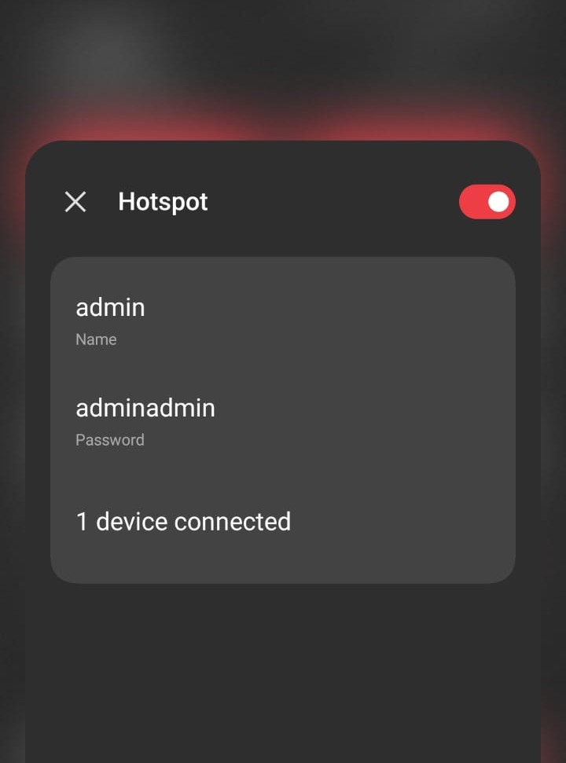
</p>

#### 2. Start the robot
Power on the robot and wait until it connects to your hotspot network

| On powering on:            | When connected to hotspot:                               | 
|--------------------|---------------------------------------------|
|    |    |

#### 3. SSH into the robot

- Connect your laptop/remote device to the same hotspot
<p align="center">
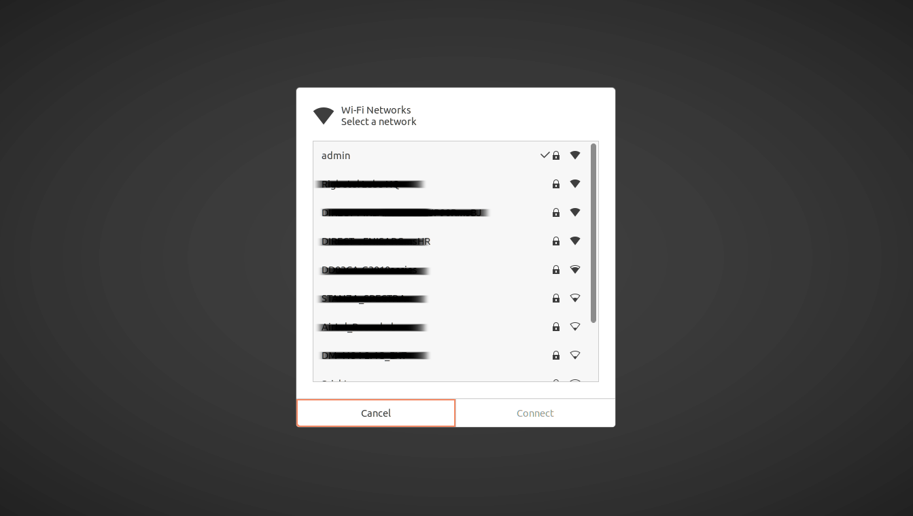
</p>

- Open a new terminal, and enter the SSH credentials
```bash
ssh "your-robot-name"@"your-robot-ip"  
pwd: "your-robot-password"
```
> [!TIP]
> The robot name and password have been provided to you while deployment, they have also been marked on the PC present inside the robot. IP can be seen on the display of robot once connected


| Method1           | Method2                            | 
|--------------------|---------------------------------------------|
| 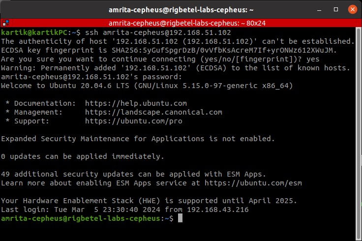   | 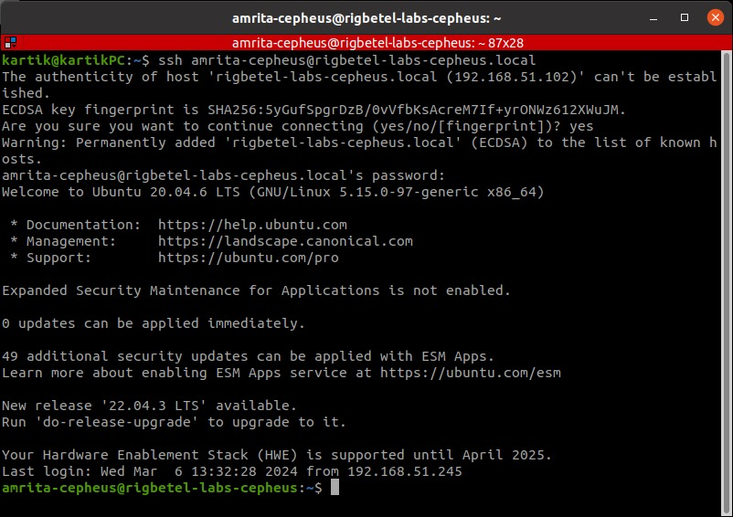    |

#### 4. Connect to Wifi

- Enter the following command on the ssh terminal to check available networks
```bash
sudo nmcli dev wifi list --rescan yes
```
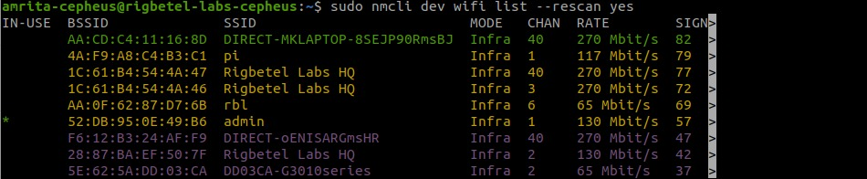 

- Connect to your wifi network
```bash
sudo nmcli device wifi connect "your-wifi-name" password "your-wifi-password"
```
 

> [!IMPORTANT]
> This will close the ssh pipeline and no response will be recieved over it further. Wait for about 30 seconds for robot to be connected to your wifi, once connected it will show the wifi name along with the IP address on the robot display.

#### 4. SSH using your Wifi
- Now the robot is connected to your Wifi network! You can now shutdown your mobile hotspot, connect your remove device to the same wifi and access the robot using SSH:

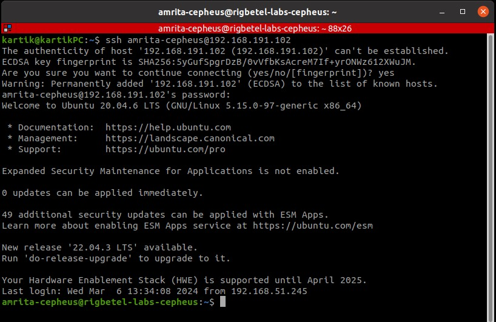 

To use your PC as a Slave Device to your Cepheus:

```bash
nano ~/.bashrc
export ROS_MASTER_URI=http://"ip address of the robot":11311
export ROS_IP="ip address of your pc"
```
## 3. NUC Instructions
### Instructions to remove Intel NUC from robot

| Step1               | Step2                                 | Step3                   |
|--------------------|---------------------------------------------|---------------------------------------------|
| 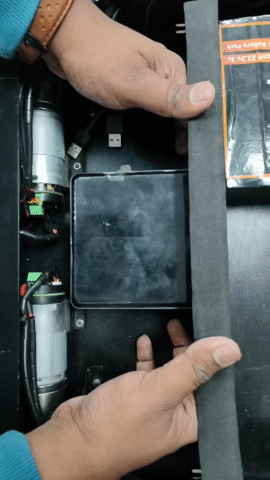   | 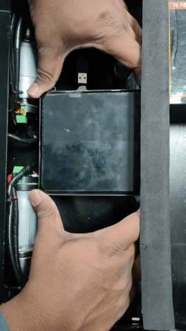   | 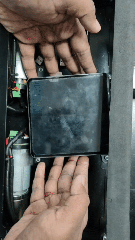      |

### USB ports Configuration
> [!IMPORTANT]
> Connect the USB ports as per the following diagram:

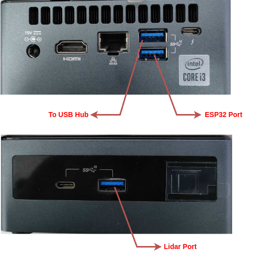

## 4. Package Description

### 4.1 cepheus_description

Holds the robot description including URDF, STL, config files for RVIZ, and Gazebo.

| File               | Description                                 | Nodes Launched                    |
|--------------------|---------------------------------------------|-----------------------------------|
| [`display.launch`](https://github.com/rigbetellabs/cepheus/blob/noetic-release/cepheus_description/launch/display.launch)   | Visualize the URDF of the robot in RVIZ.    | RVIZ, robot_state_publisher, joint_state_publisher      |
| [`gazebo.launch`](https://github.com/rigbetellabs/cepheus/blob/noetic-release/cepheus_description/launch/gazebo.launch)    | Visualize the Robot in an empty world within Gazebo. | Gazebo, robot_state_publisher    |

### 4.2 cepheus_firmware

Provides sensor and actuation topics.

| File                | Description                                             | Nodes Launched                |
|---------------------|---------------------------------------------------------|-------------------------------|
| [`bringup.launch`](https://github.com/rigbetellabs/cepheus/blob/noetic-release/cepheus_firmware/launch/bringup.launch)    | Brings up all the sensors and actuators on the robot | robot_state_publisher, joint_state_publisher, serial_node, joy, auto_joy_teleop, lidar_node |
| [`demo.launch`](https://github.com/rigbetellabs/cepheus/blob/noetic-release/cepheus_firmware/launch/demo.launch)       | Single launch file to start all nodes for mapping and navigation, accepts waypoints via joystick control. | brings up bringup.launch, server_bringup.launch and cepheus_navigation.launch all at once |
| [`ydlidar_x2.launch`](https://github.com/rigbetellabs/cepheus/blob/noetic-release/cepheus_firmware/launch/ydlidar_x2.launch) | Launch file for YDLIDAR X2 lidar configuration.        | ydlidar_node |
| [`ydlidar_x4.launch`](https://github.com/rigbetellabs/cepheus/blob/noetic-release/cepheus_firmware/launch/ydlidar_x4.launch) | Launch file for YDLIDAR X4 lidar configuration.        | ydlidar_node |
| [`rplidar_a3.launch`](https://github.com/rigbetellabs/cepheus/blob/noetic-release/cepheus_firmware/launch/rplidar_a3.launch) | Launch file for RPLIDAR A3 lidar configuration.        | rplidar_node |
| [`odom_pub.py`](https://github.com/rigbetellabs/cepheus/blob/noetic-release/cepheus_firmware/scripts/odom_pub.py)       | Publishes odometry from TF published by Cartographer.   | odom_publisher                           |
| [`network_pub.py`](https://github.com/rigbetellabs/cepheus/blob/noetic-release/cepheus_firmware/scripts/network_pub.py)       | Retrieves and publishes the Wifi/Hotspot network data   | network_status                           |
| [`diagnostics_test.py`](https://github.com/rigbetellabs/cepheus/blob/noetic-release/cepheus_firmware/scripts/diagnostics_test.py)       | Diagnostics tests for the robot in case of unusual behaviour  | diagnostics_test                           |
### 4.3 cepheus_gazebo
Simulation environment for Cepheus in Gazebo.

| File                | Description                                             | Nodes Launched                |
|---------------------|---------------------------------------------------------|-------------------------------|
| [`cepheus_warehouse.launch`](https://github.com/rigbetellabs/cepheus/blob/noetic-release/cepheus_gazebo/launch/cepheus_warehouse.launch)  | Warehouse environment spawning and simulation.       | robot_state_publisher, gazebo_ros |

### 4.4 cepheus_navigation
Autonomous navigation of the robot using `move_base` in a known as well as an unknown environment.

| File                         | Description                              | Nodes Launched                              |
|------------------------------|------------------------------------------|------------------------------------------------------|
| [`amcl.launch`](https://github.com/rigbetellabs/cepheus/blob/noetic-release/cepheus_navigation/launch/amcl.launch)                | Localize the robot in the environment.   | amcl                                              |
| [`move_base.launch`](https://github.com/rigbetellabs/cepheus/blob/noetic-release/cepheus_navigation/launch/move_base.launch)           | Node responsible for moving the robot, avoiding obstacles. | move_base                   |
| [`cepheus_navigation.launch`](https://github.com/rigbetellabs/cepheus/blob/noetic-release/cepheus_navigation/launch/cepheus_navigation.launch) | Launches `move_base` with pre-saved or online-generated map. | cartographer_occupancy_grid_node, map_server, rviz, move_base      |

### 4.5 cepheus_odometry
Rtabmap, Ekf and Cartographer based odometry packages.

| File                    | Description                                             | Additional Information                          |
|-------------------------|---------------------------------------------------------|--------------------------------------------------|
| [`carto_odometry.launch`](https://github.com/rigbetellabs/cepheus/blob/noetic-release/cepheus_odometry/launch/carto_odometry.launch) | Launches Cartographer node for lidar-based odometry.   | cartographer_ros, cartographer                   |
| [`icp_fuse.launch`](https://github.com/rigbetellabs/cepheus/blob/noetic-release/cepheus_odometry/launch/icp_fuse.launch) | Launches Rtabmap-ICP and EKF nodes for lidar and IMU fused odometry.   | icp_odometry, ekf_localization_node, alpha_beta_filter                  | 

### 4.6 cepheus_slam
Simultaneous Localization and Mapping (SLAM) for the robot.

| File                    | Description                                             | Additional Information                          |
|-------------------------|---------------------------------------------------------|--------------------------------------------------|
| [`cepheus_slam`](https://github.com/rigbetellabs/cepheus/blob/noetic-release/cepheus_slam/launch/cepheus_slam)          | Generates a map of the environment using Cartographer.  | cartographer_occupancy_grid_node                                             |
| [`map_saver.launch`](https://github.com/rigbetellabs/cepheus/blob/noetic-release/cepheus_slam/launch/map_saver.launch)      | Saves the generated map for navigation.                 | map_server                                            |


## 5. Launch Sequence

> [!NOTE]
> By default, the robot is programmed to be started up automatically upon bootup, with its ros running locally without the need for any wifi network. To get into the development mode of the robot, ssh into the robot and run
```bash
cd ros1_ws/src/cepheus
./development.sh
```
This will stop all your local ros servers permanently and allow you to test your launch files according to will. If you need the robot to be upstart upon bootup again, you can always enable it using
```bash
cd ros1_ws/src/cepheus
./demo.sh
```


### Simulation

```bash
roslaunch cepheus_gazebo cepheus_warehouse.launch
```
The gazebo world looks like this:
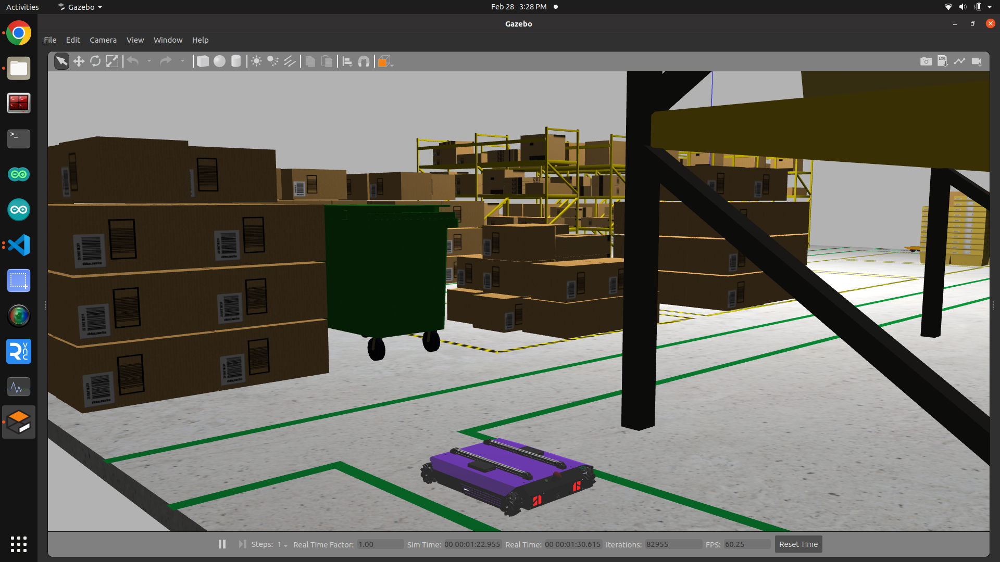

### Real Robot

```bash
roslaunch cepheus_firmware bringup.launch joy:=true # Set true to get joystick control
```

### Odometry packages

- For cartographer-based odometry:
```bash
roslaunch cepheus_odometry carto_odometry.launch 
```
- For rtabmap and ekf based odometry:
```bash
roslaunch cepheus_odometry icp_fuse.launch 
```
### 5.1 Map Generation
**For mapping with manual control**:
- Using Cartographer:
```bash
roslaunch cepheus_slam carto_slam.launch 
```
- Using Gmapping:
```bash
roslaunch cepheus_slam gmapping_slam.launch 
```
**For mapping with autonomous navigation**:

- Using Cartographer:
```bash
roslaunch cepheus_navigation cepheus_carto_navigation.launch exploration:=true 
```
- Using Gmapping:
```bash
roslaunch cepheus_navigation cepheus_gmap_amcl.launch exploration:=true 
```

**To save the map**:

```bash
roslaunch cepheus_slam map_saver.launch 
```

### 5.2 Autonomous Navigation in the Saved Map

- Using Cartographer:
```bash
roslaunch cepheus_navigation cepheus_carto_navigation.launch exploration:=false map_file:=your_map
```
- Using AMCL:
```bash
roslaunch cepheus_navigation cepheus_gmap_amcl.launch exploration:=false map_file:=your_map
```

> [!NOTE]
> Upon powering on the robot you'll be able to see the bootup animation on the robot

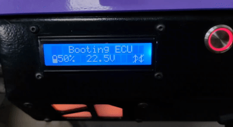 
<!--  -->

> [!NOTE]
> Once the robot is booted up and bringup.launch is initiated, you'll get to see the robot transition to READY mode

<!--   -->

## 6. Low-Level ROS Topics

#### `/battery/percentage`
This topic provides information about the remaining battery percentage of the robot. 

| Battery Percentage  | Beeping Sounds              |
|----------------------|-----------------------------|
| 100 - 20            | No beeping                  |
| 20 - 15              | Beep every 2 minutes        |
| 15 - 10              | Beep every 1 minute        |
| Below 10             | Very frequent beeping      |
| 0 (Complete Discharge)| Continuous beep             |

> [!TIP]
> To ensure you are aware of the robot's battery status, pay attention to the beeping sounds, especially as the battery percentage decreases.

> [!CAUTION]
> Do not drain the battery below `10 %`, doing so can damage the battery permanently.

#### `/battery/voltage`
This topic reports the current battery voltage, ranging from 25.2V at maximum charge to 19.8V at minimum charge.

#### `/cmd_vel`
The `/cmd_vel` topic is responsible for receiving velocity commands for the robot. These commands can be generated by teleoperation or the `move_base` module, instructing the robot on how fast to move in different directions.

#### `/pid/control`
This topic is of type `int` and is used to control the Proportional-Integral-Derivative (PID) controller. Publishing `0` stops PID control, `1` starts fast PID control, `2` activates smooth PID control, `3` activate supersmooth PID control.
Here's an example:
```bash
rostopic pub -1 /pid/control std_msgs/Int32 "data: 1"
```
#### `/diagnostics/test`
The `/diagnostics/test` topic is utilized to run diagnostics on the robot. It serves the purpose of identifying and addressing any issues that may arise during the robot's operation. For detailed diagnostics procedures, refer to the documentation.

#### `/wheel/ticks`
This topic provides an array of ticks for all four wheels of the robot, in the format `[lf, lb, rf, rb]`. These values represent the encoder readings of the wheel ticks.

#### `/wheel/vel`
The `/wheel/vel` topic sends an array of calculated velocities for each wheel on the robot, received via encoders. The format of the array is `[lf, lb, rf, rb]`, representing the actual velocity at which each wheel is moving.

## 7. Cepheus Robot Parameters

| Parameter                   | Value                                     |
|-----------------------------|-------------------------------------------|
| **Wheels Type**             | Mechanum Wheel                             |
| **Diameter**                | 0.1m                                      |
| **Wheel Separation Width**  | 0.465m                                    |
| **Wheel Separation Length** | 0.545m                                    |
| **Motor Type**              | Planetary DC Geared Motor                 |
| **RPM**                     | 100                                       |
| **Encoder Type**            | Magnetic Encoder                          |
| **PPR (Pulses Per Revolution)**| 498                                      |
| **Microcontroller**         | DOIT-ESP32 Devkit V1                      |
| **PC Used**                 | Intel NUC i3 10th Gen                     |
| **Robot Payload Capacity**  | 100 kgs                                   |
| **Battery Life**            | About 3 hours                             |
| **Battery Type**            | Lithium-ion 6-cell, 22.2V                 |

## 8. Diagnostic Tests

### Overview

The diagnostic tests are designed to ensure the proper functioning of various components of the Cepheus robot. These tests cover motor and encoder connections, motor direction, IMU connections, display connections, and a comprehensive full diagnostic test.

### Instructions

Here is a table summarizing the instructions for each diagnostic test:

| Test Number | Test Type                    |
|-------------|------------------------------|
| 0           | Full Diagnostic Test         |
| 1           | Motor and Encoder Test       |
| 2           | Motor Direction Test         |
| 3           | IMU Connections Test         |
| 4           | Display Connections Test     |

### Detailed Instructions

1. **Full Diagnostic Test (Test Number: 0):**
   - Run the full diagnostic test to check the overall health of the robot.

2. **Motor and Encoder Test (Test Number: 1):**
   - Check motor and encoder connections.

3. **Motor Direction Test (Test Number: 2):**
   - Verify motor direction.

4. **IMU Connections Test (Test Number: 3):**
   - Validate IMU (Inertial Measurement Unit) connections.

5. **Display Connections Test (Test Number: 4):**
   - Confirm proper connections with the display.

### How to Run Diagnostics

To run the diagnostic tests, follow these steps:

1. On your Cepheus terminal, launch the `bringup.launch` file:
   ```bash
   roslaunch cepheus_firmware bringup.launch
   ```

2. On your slave PC or another terminal of your Cepheus, run the diagnostics test script:
   ```bash
   python3 diagnostics_test.py
   ```

3. The script will guide you through the instructions for each diagnostic test. Follow the on-screen instructions carefully.

### Important Notes
- It is crucial to execute the tests with caution and follow the on-screen instructions for each test to ensure accurate results.
- Ensure that the robot has sufficient space to move during the motor direction test (Test Number: 2).
- If any issues are identified during the tests, refer to the specific diagnostic output for guidance on addressing the problem.

By following these instructions, you can perform diagnostic tests on the Cepheus robot to identify and resolve any issues with its components.

## 9. Joystick Control Instructions
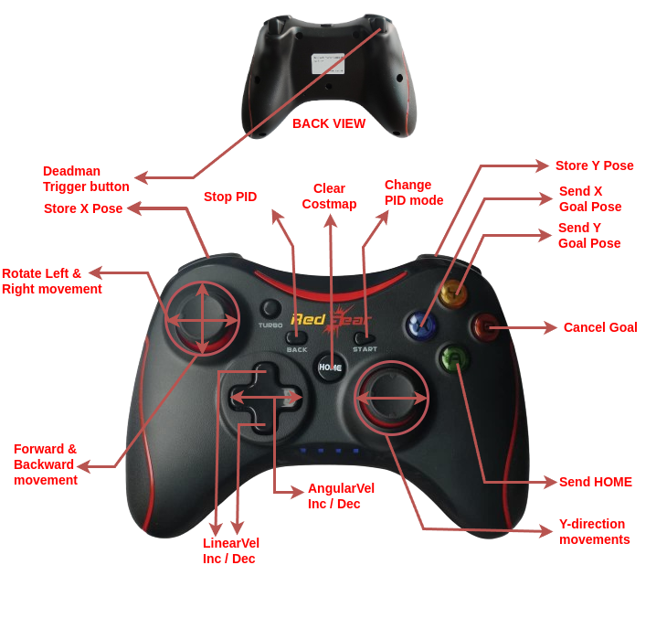

## 10. LED indicators instructions

### Nomenclature
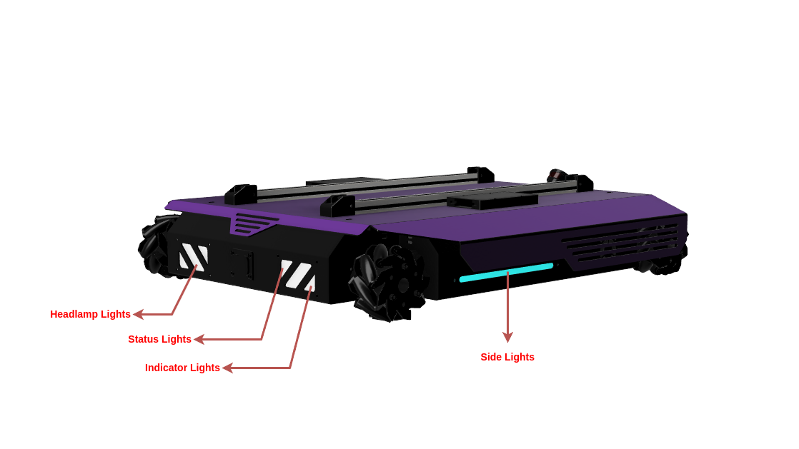


------

### Instructions
1. 
<p align="center">
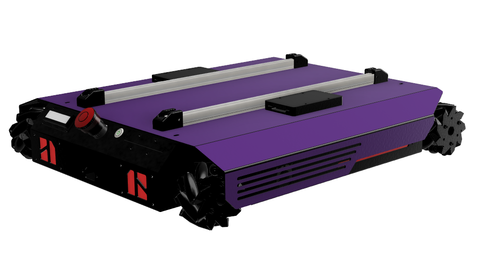

| Indication type             | Indicates            |
|-----------------------------|----------------------|
| All orange fading effect    | ROS not connected    |

</p>

------

2. 
<p align="center">
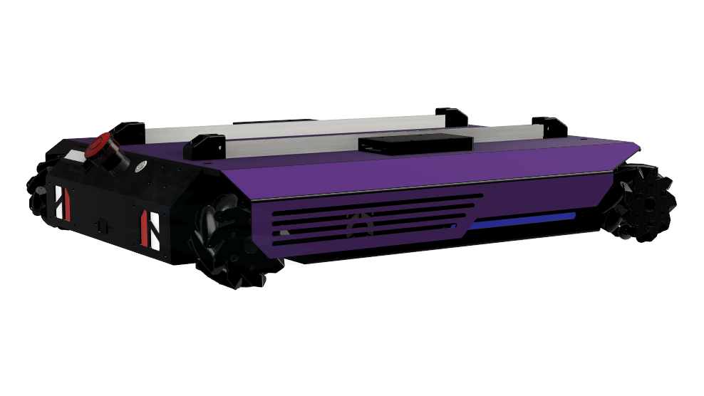

| Indication type             | Indicates            |
|-----------------------------|----------------------|
| Blue Sidelights, White Headlights, Red Brakelights | ROS Connected     |

</p>

------

3. 
<p align="center">
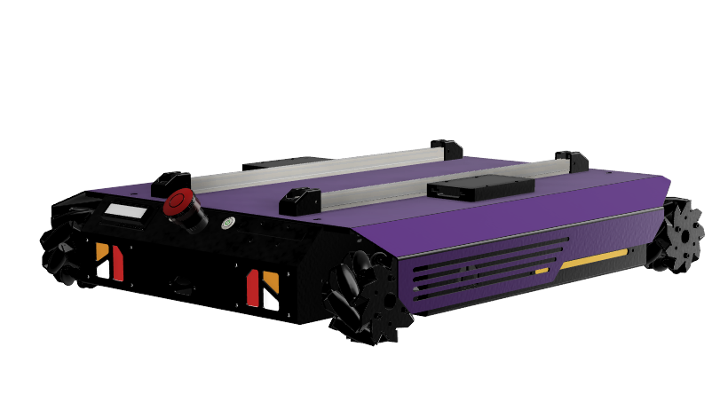

| Indication type             | Indicates            |
|-----------------------------|----------------------|
| Yellow Status/Side lights + beep 1 | Autonomous Mode |

</p>

------

4. 
<p align="center">
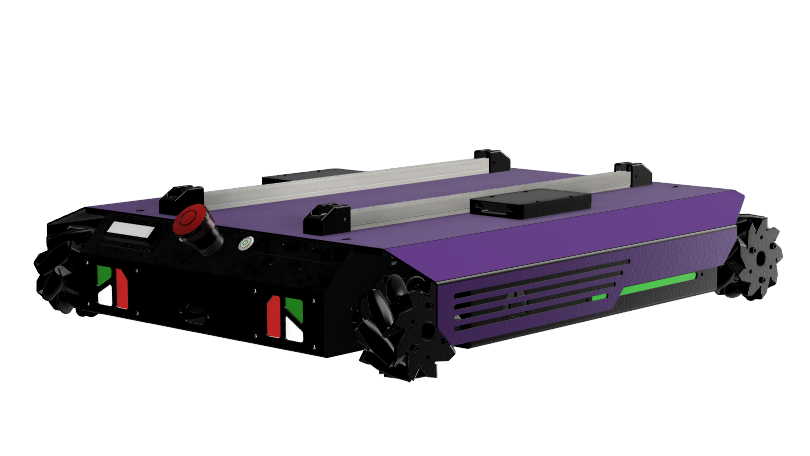

| Indication type             | Indicates            |
|-----------------------------|----------------------|
| Green Status/Side lights flash thrice with buzzer | Goal Reached     |

</p>

------

5. 
<p align="center">
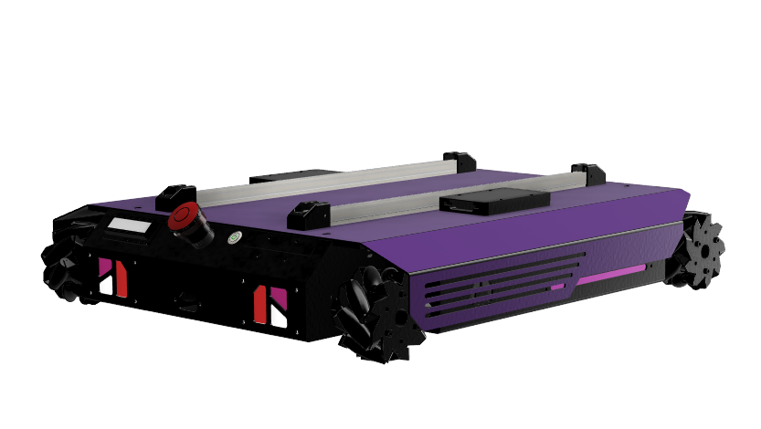

| Indication type             | Indicates            |
|-----------------------------|----------------------|
| Purple Status/Side lights with beep once | Goal location stored     |

</p>

------

6. 
<p align="center">
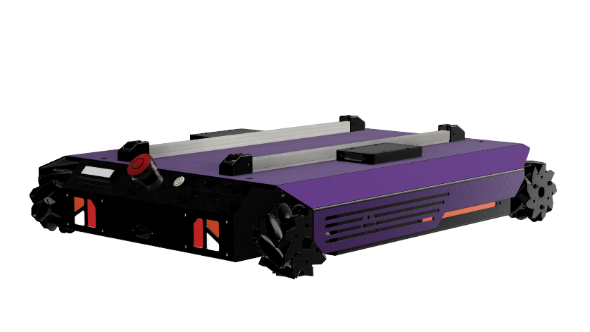

| Indication type             | Indicates            |
|-----------------------------|----------------------|
| Orange Status/Side lights   | Clear costmap    |

</p>

------

7. 
<p align="center">
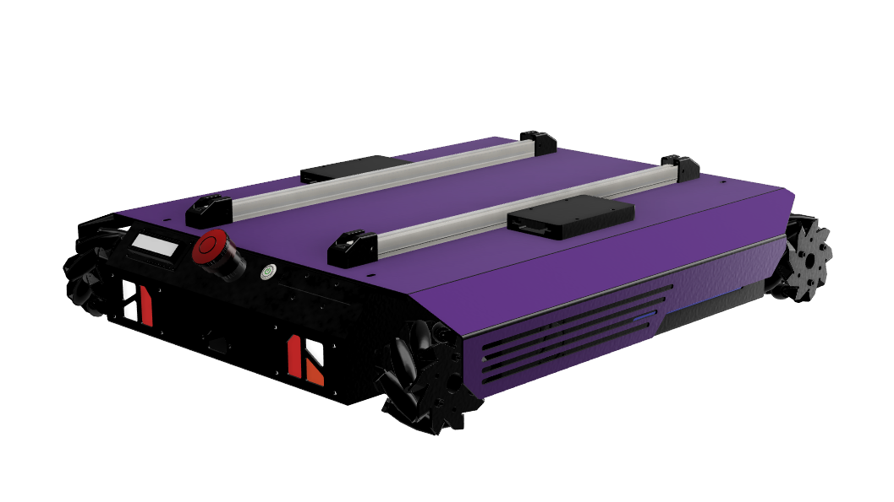

| Indication type             | Indicates            |
|-----------------------------|----------------------|
| Orange blinking indicator lights | Direction of robot travel     |

</p>

------

8. 
<p align="center">
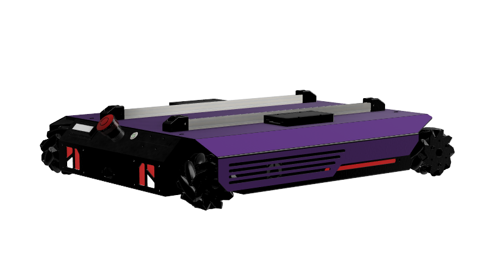

| Indication type             | Indicates            |
|-----------------------------|----------------------|
| Red Status/Side lights  | Cancel Goal/ Mission Abort    |

</p>

------

9. 
<p align="center">
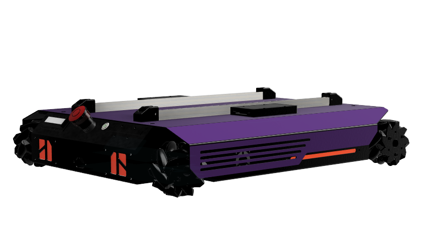

| Indication type             | Indicates            |
|-----------------------------|----------------------|
| All Red lights | Emergency button pressed    |

</p>


